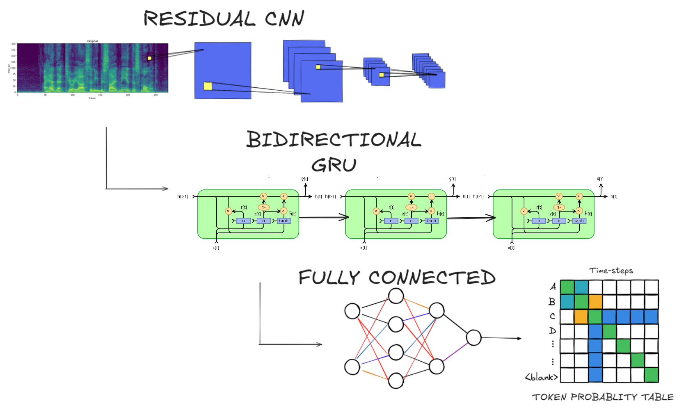
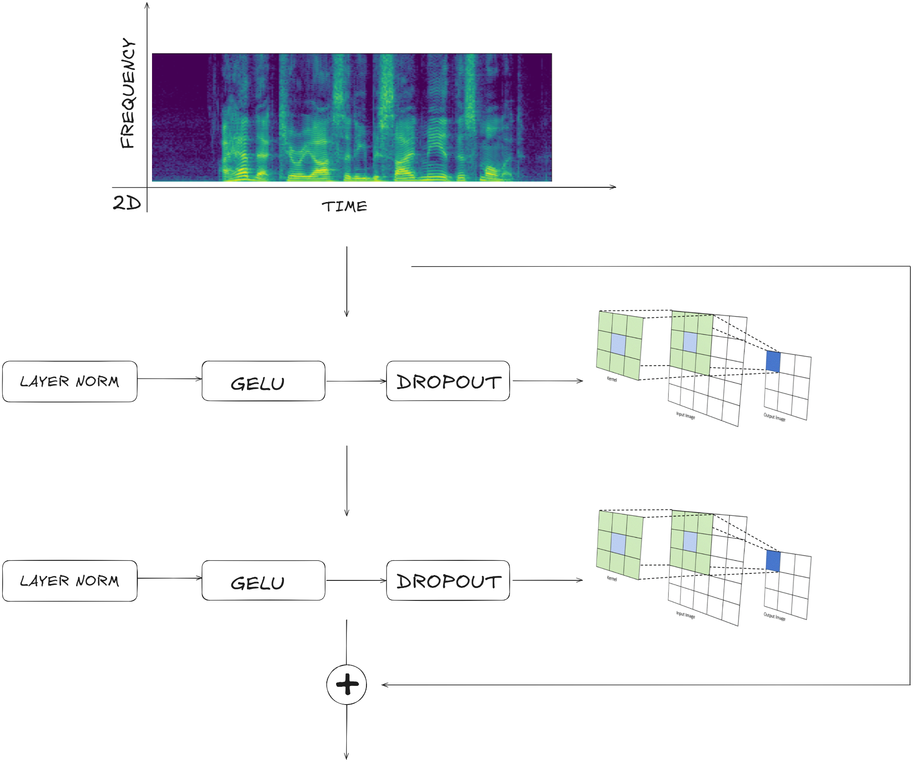
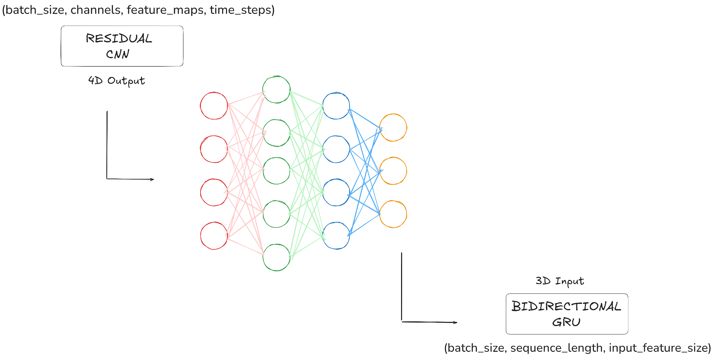
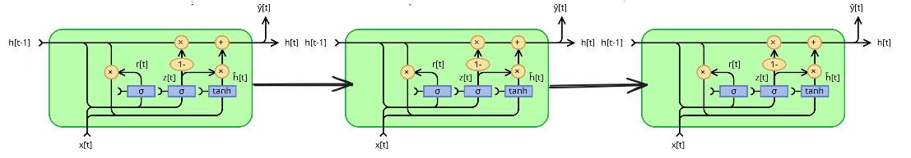
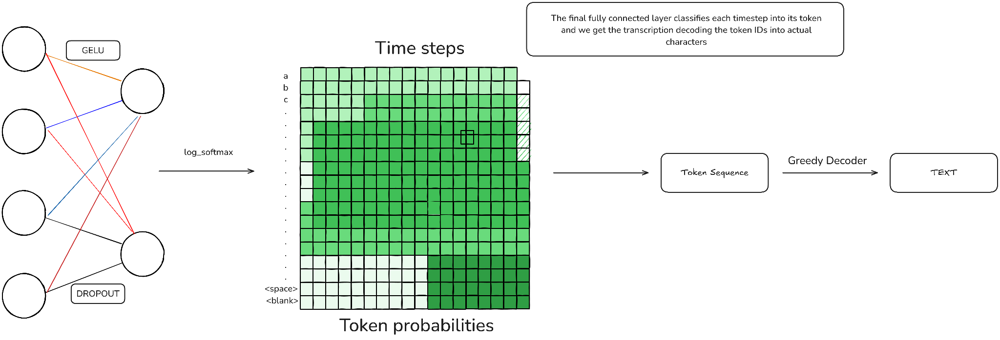

# Model architecture

## Data processing

### Audios
Audios from the mozilla catalan common voice dataset are read through the `torchaudio` library to convert them to waveforms, in this step audio length and sample rate are standarized throughout the dataset. Sample rate is converted to 16KHz and audio length is padded with silence.

The waveform then gets converted into MEL spectrograms applying aswell time and frequency masking to the training set to introduce generality and avoid overfitting.

### Text
Text transcripts are tokenized character-wise and then special characters such as accent marks are cleaned from the text for simplicity.

## Model

### Feature extraction with residual CNN

Low level audio features are extracted using 2d convolution blocks to consider audio feature throughout time and frequency, then this feature maps are inputed into a residual CNN block that extracts low level features that are added to the previous ones via residual connections.

### Dimensionality mapping

In order to ensure that `n_channels * features` = `rnn_dim` we use a fully connected layer to map this dimension, this way we also ensure that only the relevant features extracted by the CNN are passed onto the RNN block. 

### Sequence modelling with GRUs

The RNN block recieves the feature maps from the CNN and processes them to obtain sequential features, we use bidirectional GRUs. The idea behind yhe bidirectionality is to give the network past and future context from the speech, this is beacuse when we talk, letters that come after the actual can influence pronunciation.

### Final token classification and decoding

Lastly we recieve the sequential features and classify them into token IDs using a Classifier consisting on a simple two layer MLP. Then this token IDs are decoded into actual text using a greedy strategy (taking the most probable token at each timestep).

